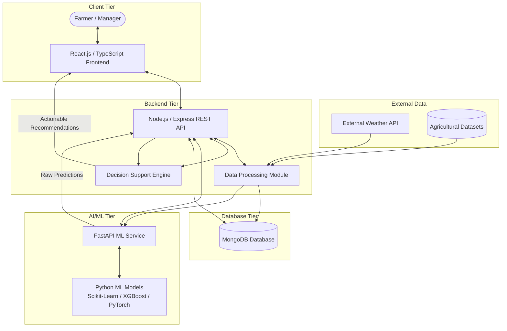
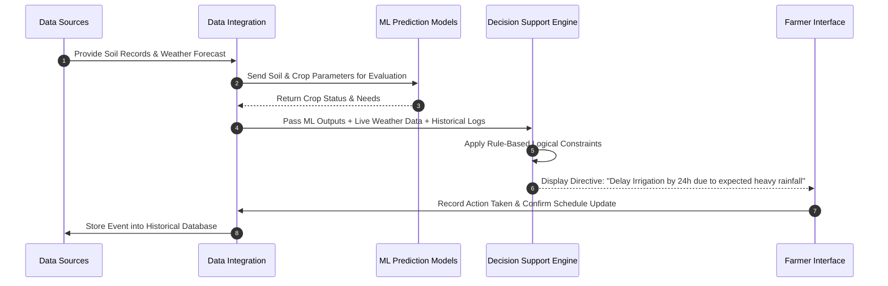

# PRJ_533 – Integrated Farm Resource Planning and Agricultural Decision Support System

An integrated agricultural resource management and decision-support platform engineered to centralize farm operations, optimize resource utilization, and provide data-driven predictive insights for modern farming.

---

## Table of Contents

- [Project Overview](#project-overview)
- [Problem Statement](#problem-statement)
- [Project Objectives](#project-objectives)
- [System Architecture](#system-architecture)
- [Technology Stack](#technology-stack)
- [Main Functional Modules](#main-functional-modules)
- [AI/ML Capabilities](#aiml-capabilities)
- [Example Decision-Support Scenario](#example-decision-support-scenario)
- [Data and Machine Learning Pipeline](#data-and-machine-learning-pipeline)
- [Project Directory Structure](#project-directory-structure)
- [Database Schema and Collections](#database-schema-and-collections)
- [REST API Specification](#rest-api-specification)
- [Installation and Setup Guide](#installation-and-setup-guide)
- [Environment Variables Configuration](#environment-variables-configuration)
- [Security Architecture](#security-architecture)
- [Testing Strategy](#testing-strategy)
- [Deployment Architecture](#deployment-architecture)
- [Expected System Benefits](#expected-system-benefits)
- [System Limitations](#system-limitations)
- [Future Enhancements](#future-enhancements)
- [Contribution Guidelines](#contribution-guidelines)
- [License](#license)
- [Acknowledgements](#acknowledgements)

---

## Project Overview

**PRJ_533** is a full-stack integrated software platform built to modernize agricultural management. It bridges the gap between raw agricultural data and day-to-day farm operations by bringing together farm administration, environmental monitoring, machine learning predictions, and rule-based decision support into a single control panel.

The system does not rely on physical hardware or direct IoT sensors. Instead, it leverages open agricultural datasets, curated soil/crop records, image-based plant disease repositories, and external weather APIs. By unifying these data streams, the system empowers farmers, farm managers, and agricultural advisors to transition from intuitive guessing to evidence-based agricultural planning.

---

## Problem Statement

Traditional agricultural practices face several operational inefficiencies and data-accessibility bottlenecks:

1. **Fragmented Farm Information**: Operational data regarding soil health, crop cycles, financial expenditures, inventory stocks, and worker allocation are typically recorded manually or split across incompatible tools.
2. **Inefficient Resource Utilization**: Over-irrigation, inaccurate fertilizer application, and mistimed pesticide deployment result in economic waste and land degradation.
3. **Absence of Predictive Insights**: Farmers lack accessible predictive tools to evaluate which crops are best suited for their specific soil chemistry or to forecast expected yields before planting.
4. **Weather Volatility and Risks**: Rapidly changing weather patterns often compromise rigid operational schedules, leading to damaged harvests when irrigation or fertilization coincides with heavy rainfall.
5. **Delayed Crop Disease Diagnosis**: Plant diseases often spread unchecked due to delayed visual identification and lack of immediate access to agricultural expertise.
6. **Financial and Supply Chain Blind Spots**: Inability to track input costs against yield revenues hinders accurate profitability calculations and long-term farm planning.

PRJ_533 addresses these challenges by consolidating administrative, analytical, and intelligent capabilities into a unified decision-support application.

---

## Project Objectives

- **Centralize Farm Data**: Provide a single repository for fields, crops, soil parameters, worker schedules, equipment inventory, and financial ledgers.
- **Provide Actionable Decision Support**: Synthesize machine learning predictions with environmental data and rule engines to generate practical recommendations rather than uncontextualized metrics.
- **Predict Optimal Crop and Yield Performance**: Utilize trained machine learning models to recommend suitable crops based on soil composition and predict expected harvest yields.
- **Enable Image-Based Disease Detection**: Implement computer vision models to identify crop diseases from uploaded leaf images and recommend mitigation strategies.
- **Optimize Resource Planning**: Reduce waste in water, fertilizer, labor, and capital through data-driven scheduling.
- **Track Farm Financial Performance**: Record operational income and expenses per harvest cycle to maintain complete financial transparency.

---

## System Architecture

The application follows a decoupled multi-tier architecture consisting of a React.js client interface, a Node.js/Express RESTful backend API, a MongoDB database, a dedicated Python FastAPI service for machine learning models, and external API integrations.



### Component Interaction Flow

1. **User Interaction**: The user interacts with the React frontend to view dashboards, record farm logs, request ML predictions, or upload leaf images.
2. **API Orchestration**: The Node.js/Express backend handles authentication, request routing, data validation, and database operations with MongoDB.
3. **Intelligence Ingestion**: When predictive operations are triggered, the Express backend sends structured feature vectors or media files to the Python FastAPI ML microservice.
4. **Model Execution**: The FastAPI service executes trained Python models (Scikit-Learn, XGBoost, PyTorch/YOLO) and returns prediction outputs to the Express backend.
5. **Decision Synthesis**: The backend passes raw predictions alongside real-time weather data, soil records, and rule sets into the Decision Support Engine.
6. **Response Delivery**: The synthesized, actionable recommendation is stored in MongoDB and rendered on the client dashboard.

---

## Technology Stack

The platform is engineered using modern, industry-standard technologies across all tiers of the application stack.

### Frontend

| Technology | Purpose |
| :--- | :--- |
| React.js | UI component architecture and client-side rendering |
| TypeScript | Type safety, interface definitions, and maintainable codebase |
| Tailwind CSS | Utility-first styling framework for responsive design |
| shadcn/ui | Accessible UI component primitives |
| Recharts | Data visualization and interactive analytical charting |
| Leaflet & OpenStreetMap | Geospatial visualization for farm fields and land mapping |

### Backend

| Technology | Purpose |
| :--- | :--- |
| Node.js | Asynchronous JavaScript runtime engine |
| Express.js | RESTful HTTP web application framework |
| JWT (JSON Web Tokens) | Stateless client authentication and access management |
| bcrypt | Secure password hashing algorithm |
| Express Middleware | Request validation, authorization, and error handling |

### Database

| Technology | Purpose |
| :--- | :--- |
| MongoDB | NoSQL document database for scalable data storage |
| Mongoose ODM | Object Data Modeling library for schema enforcement and queries |

### Machine Learning and Data Science

| Technology | Purpose |
| :--- | :--- |
| Python | Core programming language for data processing and model execution |
| FastAPI | High-performance Python web framework for ML inference APIs |
| Pandas & NumPy | Data manipulation, transformation, and numerical computations |
| Scikit-learn | Supervised learning algorithms for crop & fertilizer recommendation |
| XGBoost | Gradient boosted decision trees for yield prediction models |
| PyTorch | Deep learning framework for neural network inference |
| YOLO & OpenCV | Real-time object detection and image preprocessing for disease identification |

### External Data and Infrastructure

| Data / Tool | Purpose |
| :--- | :--- |
| Weather API | Real-time and forecasted meteorological data integration |
| Agricultural Datasets | Training data for soil chemistry, crop requirements, yield history, and plant pathology |
| Git & GitHub | Version control system and collaborative codebase management |
| Docker | Containerization of backend, frontend, and ML microservices |
| MongoDB Atlas | Cloud-hosted managed database service |
| Vercel / Render / Railway | Cloud hosting platforms for application deployment |
| Postman | API endpoint development, testing, and documentation |


---

## Main Functional Modules

| Module | Functional Description |
| :--- | :--- |
| **User Authentication & Authorization** | Manages user registration, login, session security via JWT, and role-based permissions (Admin, Farm Manager, Worker). |
| **Farm Management** | Manages high-level farm metadata, geographic location, ownership details, and overall operational settings. |
| **Land & Field Management** | Tracks individual field plots, boundaries, acreage, terrain type, and current operational status. |
| **Crop Management** | Records crop types, planting dates, growth stages, expected harvest timelines, and historical field rotations. |
| **Soil Information Management** | Logs soil chemistry records including Nitrogen (N), Phosphorus (P), Potassium (K), pH, electrical conductivity, and organic matter. |
| **Weather Monitoring** | Ingests real-time and multi-day forecasted precipitation, temperature, humidity, and wind speed data for farm coordinates. |
| **Inventory Management** | Tracks farm supplies, equipment, seeds, tools, and chemical stocks with low-quantity alerts and usage history. |
| **Fertilizer & Pesticide Management** | Records chemical application schedules, dosage rates, safety intervals, and field application histories. |
| **Worker / Labour Management** | Schedules farm staff, assigns tasks across specific fields, and tracks worker hours and activity statuses. |
| **Expense & Income Management** | Financial ledger tracking operational costs (seeds, labor, fuel, chemicals) against revenue from crop sales. |
| **Harvest Management** | Captures harvest outputs, crop quality metrics, storage destination, and yield comparison against historical baselines. |
| **AI/ML Predictions** | Interface for running predictive algorithms for crop suitability, expected yield, and fertilizer adjustments. |
| **Crop Disease Analysis** | Processes uploaded leaf images to detect visual signs of infection, returning disease names and confidence scores. |
| **Agricultural Recommendations** | Synthesizes prediction metrics, environmental status, and rule logic into prioritized operational directives. |
| **Alerts & Notifications** | Generates system notifications for upcoming tasks, weather warnings, low inventory, and disease risks. |
| **Reports & Analytics** | Generates visual analytical reports on financial performance, yield trends, resource usage, and soil health. |

---

## AI/ML Capabilities

The intelligence layer of PRJ_533 consists of four specialized machine learning modules and one unified decision-support engine.

### 1. Crop Recommendation Engine
- **Input Features**: Soil Nitrogen (N), Phosphorus (P), Potassium (K), pH level, ambient temperature, humidity, and annual rainfall.
- **Model Architecture**: Multi-class classification algorithms (Random Forest / Decision Trees / SVM) trained on agricultural soil-crop datasets.
- **Output**: Ranked list of suitable crops optimized for the specified soil composition and climate parameters.

### 2. Crop Yield Prediction Model
- **Input Features**: Selected crop type, field area (hectares), historical rainfall, soil chemical profile, average temperature, and irrigation frequency.
- **Model Architecture**: Gradient Boosted Trees (XGBoost) and Regression models calibrated on historical yield metrics.
- **Output**: Forecasted crop yield expressed in metric tons per hectare alongside estimated total harvest volume.

### 3. Fertilizer Recommendation Engine
- **Input Features**: Current soil NPK deficits, targeted crop nutrient requirements, field soil pH, and current crop growth stage.
- **Model Architecture**: Hybrid model combining rule-based nutritional tables with supervised learning classifiers.
- **Output**: Specific fertilizer recommendations (e.g., Urea, DAP, NPK formulations) with precise application dosage and timing.

### 4. Image-Based Crop Disease Detection
- **Input Features**: User-uploaded leaf imagery captured via camera or mobile upload.
- **Model Architecture**: Deep Convolutional Neural Networks (CNN) / PyTorch / YOLO models fine-tuned on plant pathology image datasets (such as PlantVillage).
- **Output**: Identified disease classification, severity level, confidence percentage, and recommended treatment protocols.

### 5. Integrated Agricultural Decision-Support Engine
- **Functionality**: Raw ML output is rarely sufficient for direct farm action. The decision-support engine combines model predictions with real-time weather forecasts, soil status, and predefined agricultural logic to produce context-aware directives.

---

## Example Decision-Support Scenario

Consider a scenario where a farmer is cultivating tomatoes:

```text
[Input State]
• Crop: Tomato (Flowering Stage)
• Field Soil Status: Moisture level indicates low soil hydration (Requires Irrigation)
• System Trigger: Soil Moisture rule triggers "Irrigation Required" flag
• Weather Forecast API: 85% probability of heavy rainfall (45mm) within 12 hours
```

### Traditional vs. System Decision

- **Without Decision Support**: The farmer relies solely on soil dryness and initiates a full irrigation cycle. Within hours, heavy rainfall occurs, resulting in flooded soil, nutrient leaching, root asphyxiation, and wasted energy/water.
- **With PRJ_533 Decision Support**: The decision engine cross-references the soil moisture alert with the incoming precipitation forecast. The system evaluates the rule set:

```text
IF soil_moisture == LOW 
AND expected_precipitation_24h > 20mm 
THEN recommendation = "DELAY_IRRIGATION"
```

### Operational Workflow Sequence



---

## Data and Machine Learning Pipeline

The system processes raw agricultural datasets through a structured data engineering and machine learning pipeline before deploying serialized models to the prediction microservice.

```text
Raw Agricultural Datasets
         │
         ▼
 ┌───────────────┐
 │ Data Cleaning │  --> Handling missing values, outlier filtering, normalization
 └───────┬───────┘
         │
         ▼
 ┌───────────────┐
 │ Preprocessing │  --> Feature encoding, scaling (StandardScaler/MinMaxScaler)
 └───────┬───────┘
         │
         ▼
 ┌─────────────────────┐
 │ Feature Engineering │ --> Interaction terms, soil index ratio generation
 └───────┬─────────────┘
         │
         ▼
 ┌──────────────────┐
 │ Train/Test Split │  --> Stratified splitting for class balance
 └───────┬──────────┘
         │
         ▼
 ┌────────────────┐
 │ Model Training │  --> Algorithm fitting (Scikit-Learn, XGBoost, PyTorch)
 └───────┬────────┘
         │
         ▼
 ┌──────────────────┐
 │ Model Evaluation │  --> Accuracy, F1-Score, RMSE, Confusion Matrix validation
 └───────┬──────────┘
         │
         ▼
 ┌─────────────────────┐
 │ Model Serialization │ --> Exporting serialized weights (.pkl / .pt / .onnx)
 └───────┬─────────────┘
         │
         ▼
 ┌─────────────────┐
 │ FastAPI Service │  --> Exposing HTTP POST endpoints for model inference
 └───────┬─────────┘
         │
         ▼
 ┌─────────────────┐
 │ Node.js Express │  --> Orchestrating payloads between client and ML service
 └───────┬─────────┘
         │
         ▼
 ┌─────────────────┐
 │ Decision Engine │  --> Combining predictions with rule-based heuristics
 └───────┬─────────┘
         │
         ▼
  Actionable Recommendation
```

---

## Project Directory Structure

```text
PRJ_533-Farm-Management/
├── frontend/                     # React.js TypeScript Client Application
│   ├── public/                   # Static assets and index HTML
│   ├── src/
│   │   ├── components/           # Reusable UI primitives (shadcn/ui, layout)
│   │   ├── pages/                # Application routes (Dashboard, Fields, AI)
│   │   ├── services/             # API client services (Axios / Fetch wrappers)
│   │   ├── utils/                # Helper utilities and formatters
│   │   ├── types/                # TypeScript interfaces and type definitions
│   │   ├── App.tsx               # Root component and router configuration
│   │   └── main.tsx              # Application entry point
│   ├── package.json
│   ├── tailwind.config.js
│   └── tsconfig.json
│
├── backend/                      # Node.js Express REST API Server
│   ├── src/
│   │   ├── config/               # Database connection and environment config
│   │   ├── controllers/          # Business logic handlers per domain entity
│   │   ├── middleware/           # Auth validation, error handling, RBAC
│   │   ├── models/               # Mongoose schemas (User, Farm, Field, etc.)
│   │   ├── routes/               # Express API endpoint definitions
│   │   ├── services/             # External integration services (Weather, ML)
│   │   └── server.js             # Express application initialization
│   ├── package.json
│   └── .env.example
│
├── ml-service/                   # Python FastAPI Machine Learning Microservice
│   ├── app/
│   │   ├── api/                  # FastAPI router endpoints for predictions
│   │   ├── models/               # Serialized trained model weights (.pkl/.pt)
│   │   ├── pipelines/            # Preprocessing and inference pipelines
│   │   ├── utils/                # Helper functions for image/tensor conversion
│   │   └── main.py               # FastAPI application entry point
│   ├── requirements.txt
│   └── .env.example
│
├── datasets/                     # Reference agricultural training datasets
│   ├── raw/                      # Original CSV/image dataset files
│   └── processed/                # Cleaned and processed feature matrices
│
├── docker/                       # Containerization configurations
│   ├── docker-compose.yml
│   ├── Dockerfile.frontend
│   ├── Dockerfile.backend
│   └── Dockerfile.ml
│
├── docs/                         # Architecture diagrams and project documentation
└── README.md                     # Project README
```

---

## Database Schema and Collections

The backend uses MongoDB with Mongoose ODM to manage data persistence. The key database collections and their primary attributes are structured as follows:

| Collection Name | Description | Key Fields & Attributes |
| :--- | :--- | :--- |
| `users` | User credentials and profile management | `_id`, `name`, `email`, `passwordHash`, `role`, `createdAt` |
| `farms` | Top-level farm entity records | `_id`, `ownerId`, `farmName`, `location`, `totalArea`, `createdAt` |
| `fields` | Specific land parcel details | `_id`, `farmId`, `fieldName`, `areaHectares`, `soilType`, `status` |
| `crops` | Active and historical crop cycles | `_id`, `fieldId`, `cropName`, `variety`, `plantingDate`, `expectedHarvest` |
| `soil_records` | Soil chemistry log entries | `_id`, `fieldId`, `nitrogen`, `phosphorus`, `potassium`, `pH`, `sampledAt` |
| `weather_records` | Cached weather observation snapshots | `_id`, `farmId`, `temperature`, `humidity`, `rainfall`, `recordedAt` |
| `inventory` | Farm supply stock management | `_id`, `farmId`, `itemName`, `category`, `quantity`, `unit`, `reorderLevel` |
| `workers` | Farm labor personnel directory | `_id`, `farmId`, `fullName`, `role`, `contactPhone`, `assignedFieldId` |
| `expenses` | Operational financial expenditure records | `_id`, `farmId`, `category`, `amount`, `description`, `expenseDate` |
| `income` | Harvest sale and revenue records | `_id`, `farmId`, `harvestId`, `amount`, `buyer`, `transactionDate` |
| `harvests` | Yield collection metrics | `_id`, `cropId`, `quantityHarvested`, `qualityGrade`, `harvestDate` |
| `predictions` | ML engine prediction output logs | `_id`, `fieldId`, `predictionType`, `inputData`, `result`, `createdAt` |
| `recommendations` | Synthesized system directives | `_id`, `farmId`, `category`, `title`, `description`, `priority`, `status` |
| `alerts` | Actionable system notifications | `_id`, `farmId`, `alertType`, `message`, `isRead`, `createdAt` |

---

## REST API Specification

The Node.js backend exposes a RESTful API organized by resource routes:

| Base Route | HTTP Method | Target Endpoint | Description |
| :--- | :--- | :--- | :--- |
| `/api/auth` | `POST` | `/register` | Register a new user account |
| | `POST` | `/login` | Authenticate user credentials and return JWT |
| `/api/users` | `GET` | `/profile` | Retrieve current authenticated user profile |
| `/api/farms` | `GET` / `POST` | `/` | Fetch all registered farms or create a new farm |
| `/api/fields` | `GET` / `POST` | `/` | List fields for a farm or register a new plot |
| `/api/crops` | `GET` / `POST` | `/` | Retrieve crop logs or create a new crop cycle |
| `/api/soil` | `GET` / `POST` | `/` | Fetch field soil history or add a new soil test record |
| `/api/weather` | `GET` | `/:farmId` | Retrieve current weather and forecast for a farm |
| `/api/inventory` | `GET` / `POST` | `/` | Manage farm supply stocks and equipment inventories |
| `/api/workers` | `GET` / `POST` | `/` | Manage worker assignments and labor logs |
| `/api/expenses` | `GET` / `POST` | `/` | Record and query operational expenses |
| `/api/harvest` | `GET` / `POST` | `/` | Log yield harvests and query production outputs |
| `/api/predictions` | `POST` | `/crop` | Request crop suitability prediction from ML service |
| | `POST` | `/yield` | Request expected harvest yield estimation |
| | `POST` | `/disease` | Upload image for plant disease classification |
| `/api/recommendations` | `GET` | `/:farmId` | Fetch generated decision-support recommendations |
| `/api/reports` | `GET` | `/financial` | Generate financial and yield summary analytics |

---

## Installation and Setup Guide

Follow these steps to set up and run the system locally for development.

### Prerequisites

Ensure the following software packages are installed on your local environment:
- **Node.js** (v18.x or higher)
- **npm** (v9.x or higher)
- **Python** (v3.10 or higher)
- **MongoDB** (v6.0+ local installation or MongoDB Atlas account)
- **Git**
- **Docker & Docker Compose** (Optional, for containerized execution)

---

### Step 1: Clone the Repository

```bash
git clone https://github.com/your-username/PRJ_533-Farm-Management.git
cd PRJ_533-Farm-Management
```

---

### Step 2: Configure Environment Variables

Create `.env` configuration files in the `backend`, `frontend`, and `ml-service` directories based on the templates provided in [.env.example](#environment-variables-configuration).

---

### Step 3: Backend Setup (Node.js & Express)

```bash
cd backend
npm install
npm run dev
```
*The Express server will start on `http://localhost:5000`.*

---

### Step 4: ML Microservice Setup (FastAPI & Python)

```bash
# Navigate to ml-service directory from project root
cd ml-service

# Create and activate a Python virtual environment
python -m venv venv

# On Windows:
venv\Scripts\activate
# On macOS/Linux:
# source venv/bin/activate

# Install required Python dependencies
pip install -r requirements.txt

# Start the FastAPI application
uvicorn app.main:app --reload --port 8000
```
*The FastAPI server will start on `http://localhost:8000`.*

---

### Step 5: Frontend Setup (React.js)

```bash
# Navigate to frontend directory from project root
cd frontend
npm install
npm run dev
```
*The React development server will start on `http://localhost:5173`.*

---

### Alternative: Running with Docker Compose

If Docker is installed on your system, you can build and run all services concurrently using Docker Compose:

```bash
cd docker
docker-compose up --build
```

---

## Environment Variables Configuration

### Backend Environment Variables (`backend/.env`)

```env
PORT=5000
NODE_ENV=development
MONGODB_URI=mongodb://localhost:27017/farm_management
JWT_SECRET=your_jwt_secret_key_here
JWT_EXPIRES_IN=7d
WEATHER_API_KEY=your_openweather_api_key_here
WEATHER_API_URL=https://api.openweathermap.org/data/2.5
ML_SERVICE_URL=http://localhost:8000
CORS_ORIGIN=http://localhost:5173
```

### ML Service Environment Variables (`ml-service/.env`)

```env
PORT=8000
ENVIRONMENT=development
MODEL_PATH=./app/models/
ALLOWED_ORIGINS=http://localhost:5000
```

### Frontend Environment Variables (`frontend/.env`)

```env
VITE_API_BASE_URL=http://localhost:5000/api
VITE_APP_NAME="Integrated Farm Resource Planning"
```

---

## Security Architecture

The platform incorporates basic security controls across application layers:

- **Authentication & Session Security**: Stateless authentication implemented via JSON Web Tokens (JWT) signed with secure secret keys and set with configurable expiration periods.
- **Password Protection**: Passwords are hashed before database storage using `bcrypt` salt rounds.
- **Role-Based Access Control (RBAC)**: Middleware handles authorization checks to restrict access to sensitive admin operations.
- **Input Validation & Sanitization**: Incoming request payloads are validated using middleware schema checking to prevent malicious inputs.
- **Environment Isolation**: Application secrets, API keys, and database connection strings are managed via isolated `.env` environment files.
- **CORS Policies**: Cross-Origin Resource Sharing (CORS) is configured on backend services to restrict unauthorized cross-domain API invocation.

---

## Testing Strategy

Quality assurance and model verification are conducted across individual application layers:

- **Backend API Testing**: Endpoint routing, authentication middleware, and data transformation logic are validated using Postman collection collections and HTTP request suites.
- **ML Model Evaluation**: Machine learning models are evaluated prior to serialization using standardized statistical metrics:
  - Classification models (Crop & Disease): Accuracy, Precision, Recall, F1-Score, Confusion Matrix.
  - Regression models (Yield): Root Mean Squared Error (RMSE), Mean Absolute Error (MAE), R-squared ($R^2$) coefficient.
- **Frontend Verification**: UI component rendering, form validation state management, and API integration are manually and functionally verified across common client resolutions.

---

## Deployment Architecture

The application is designed for cloud-native deployment using distributed hosting providers:

```text
┌─────────────────────────────────┐
│     Client (Browser / User)     │
└────────────────┬────────────────┘
                 │
                 ▼
┌─────────────────────────────────┐
│         Frontend Host           │  --> Hosted on Vercel
│       (React.js Static Build)   │
└────────────────┬────────────────┘
                 │
                 ▼
┌─────────────────────────────────┐
│          Backend Host           │  --> Hosted on Render / Railway
│      (Node.js / Express API)    │
└────────┬────────────────┬───────┘
         │                │
         ▼                ▼
┌─────────────────┐  ┌─────────────────┐
│   ML Microservice│  │   Cloud DB      │
│ Hosted on Render│  │ MongoDB Atlas   │
│   (FastAPI ML)  │  │ (Managed DB)    │
└─────────────────┘  └─────────────────┘
```

---

## Expected System Benefits

| User Group | Expected System Benefits |
| :--- | :--- |
| **Farmers** | Access clear directives on crop selection, fertilizer application, disease risks, and irrigation schedules. |
| **Farm Managers** | Centralize worker scheduling, monitor field status, track equipment inventory, and manage operational budgets. |
| **Agricultural Organizations** | Gather aggregate insights regarding crop yields, regional soil trends, and resource usage patterns. |
| **Researchers & Students** | Study practical integrations of machine learning algorithms within multi-tier decision-support frameworks. |

---

## System Limitations

1. **Dataset Dependency**: The accuracy of ML predictions is bounded by the representative quality, sample volume, and balance of the underlying training datasets.
2. **External API Reliance**: Weather monitoring functions depend on third-party API connectivity and service uptime.
3. **No Direct Hardware Control**: The system is designed purely as a decision-support platform; it does not directly actuate physical machinery or automated irrigation valves.
4. **Advisory Nature**: System outputs provide recommendations intended to support, rather than replace, qualified agricultural judgment and expert local domain knowledge.

---

## Future Enhancements

- **Satellite and GIS Integration**: Incorporate remote sensing data (Sentinel / Landsat) for automated vegetation index (NDVI) monitoring.
- **Market Price Intelligence**: Integrate real-time agricultural commodity market prices to forecast crop profitability before planting.
- **Multilingual & Voice Support**: Implement regional language interfaces and voice-driven queries for improved accessibility in rural farming communities.
- **Mobile Native Application**: Develop dedicated React Native / Flutter mobile applications with offline logging capabilities.
- **IoT Hardware Integration**: Expand system interfaces to ingest live telemetric streams from physical soil moisture and microclimate sensors.

---

## Contribution Guidelines

Contributions from developers, data scientists, and agricultural researchers are welcome! 

For comprehensive, step-by-step instructions on setting up your local development environment, environment variable configurations, branch naming conventions, commit guidelines, coding standards, and submitting pull requests, please refer to our dedicated [CONTRIBUTING.md](CONTRIBUTING.md) guide.

Quick Git Workflow:
1. **Fork** the repository on GitHub.
2. **Create a Feature Branch**: `git checkout -b feature/your-feature-name`
3. **Commit Your Changes**: `git commit -m "feat(module): add descriptive summary of changes"`
4. **Push to the Branch**: `git push origin feature/your-feature-name`
5. **Open a Pull Request**: Submit your pull request against the `main` branch.

---

## License

License information will be added before public release.

---

## Acknowledgements

- **PlantVillage Dataset**: For curated plant pathology image repositories used in disease identification.
- **OpenWeather API**: For providing meteorological data services.
- **Open-Source Communities**: Python Data Science community (Scikit-Learn, PyTorch, XGBoost, Pandas), React.js, and Node.js ecosystems for open-source frameworks and libraries.
